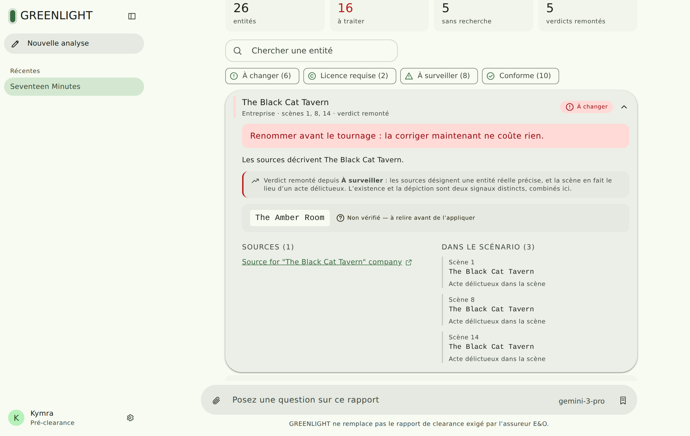
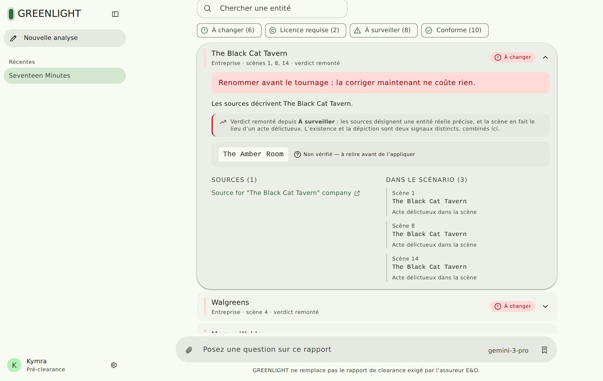
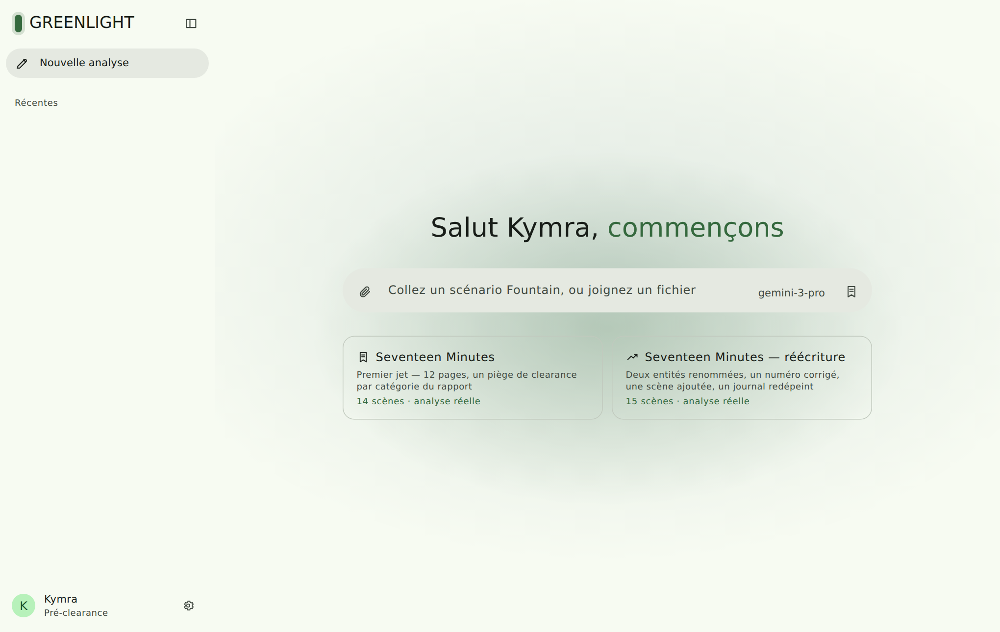
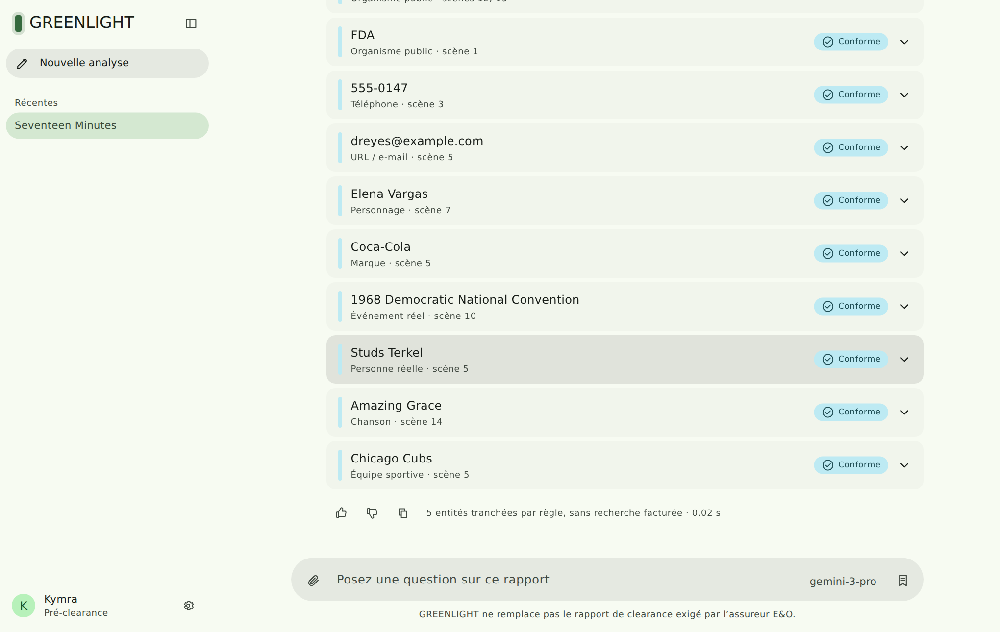
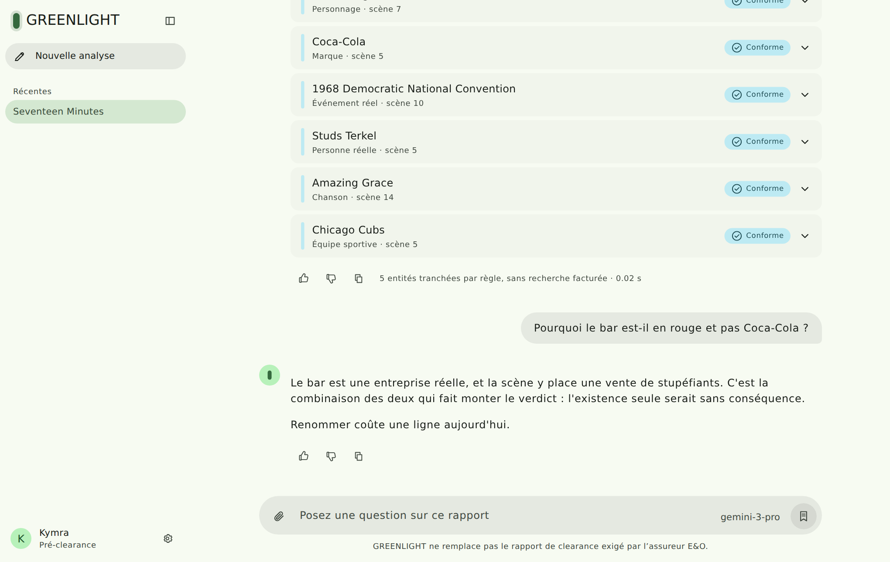
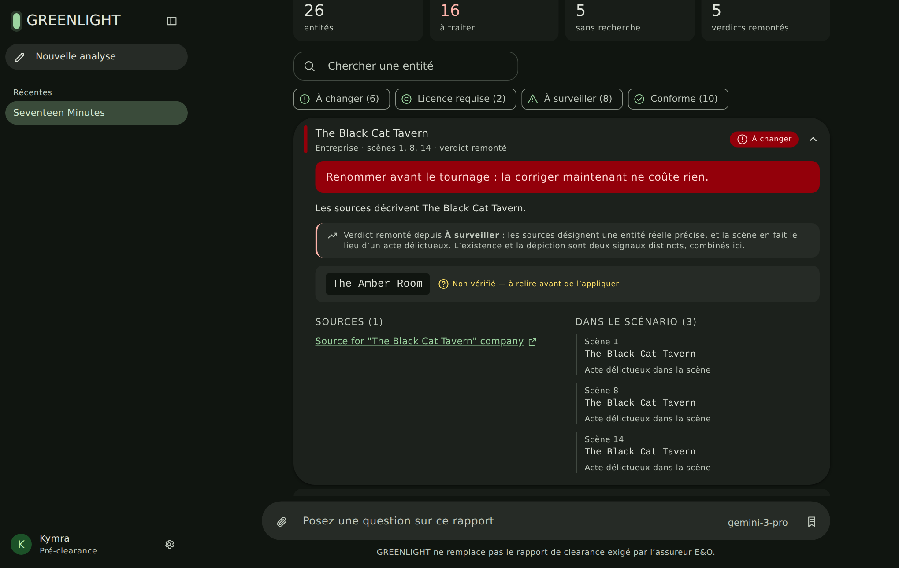
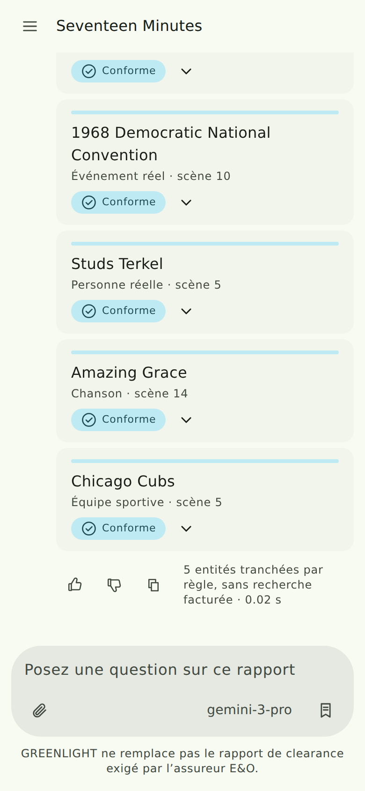

<div align="center">

# 🟢 GREENLIGHT

### Automated pre-clearance for screenplays

**Catch the legal landmines in a script *while they are still free to fix*.**

[](LICENSE)
[](pyproject.toml)
[](https://github.com/kymrapro-del/Greenlight/actions/workflows/ci.yml)
[](backend/tests)
[](https://cloud.google.com/vertex-ai)
[](https://docs.parallel.ai/search/search-quickstart)
[](https://m3.material.io)
[](https://agentic-cinema.devpost.com)

<br />



<sub>A clearance report, rendered inside the answer. Twenty-six entities, five escalated by how the scene depicts them.</sub>

</div>

---

## ⚡ At a glance

| | |
|---|---|
| 🎬 **What it does** | Reads a screenplay, finds every named entity, checks each against the live web, and returns a sourced clearance report |
| ⏱️ **Instead of** | ~1 week and several thousand dollars, once, on the locked script |
| 🧠 **The core idea** | The *same* real entity gets a different verdict depending on what the scene does with it |
| 🔁 **Why it scales** | Draft-to-draft diff re-analyses only what moved — **81 % of the research skipped** on the test rewrite |
| 🤖 **Models** | Gemini via `google-genai`, orchestrated with a native **ADK `Workflow`** |
| 🌐 **Search** | **Parallel Search API**, risk-routed: `fast` in bulk, `advanced` only where the verdict is in play |
| 🎨 **Interface** | A conversation, in **Material 3** — one source colour generates the whole theme |
| 💸 **Cost in CI** | Zero. Every test replays recorded responses |

---

## 🎬 The problem nobody codes for

Before a film can be shot, the production must obtain a **script clearance
report**. Without it there is no E&O insurance, and without insurance no
distributor will touch the film. It is not optional.

A human reads the screenplay and catalogues **every named entity** — character
names, businesses, brands, phone numbers, addresses, licence plates, songs,
artworks, hospitals, publications — then researches each one to determine
whether it exists in the real world and whether using it invites a lawsuit.

That takes roughly a week and costs several thousand dollars per script.

**And it happens too late.** Clearance runs on the locked script. By then,
renaming a bar means rebuilding set dressing, remaking props, and re-recording
ADR. So productions negotiate, take risks, or pay for a licence.

## 💡 The idea: shift clearance left

Software security moved from the end-of-cycle pentest to a linter in the
editor. Screenplay clearance never made that move.

GREENLIGHT reads a screenplay, extracts every entity, verifies each one against
the live web with traceable sources, and returns a clearance report in minutes —
fast enough and cheap enough to run on **every draft**, not once at the end.

> A writer who learns on page 12 that *The Black Cat Tavern* is a real, operating
> business fixes it in three seconds. The same fix six months later costs a
> shooting day.

---

## 🧠 Why this is not "an LLM with web search"

Six mechanisms, each of which changes a verdict or a bill.

### 1 · Depiction context is the risk multiplier

Naming a real bar is harmless. The *same* bar where a character deals drugs is
defamation exposure. Existence and depiction are two separate signals, combined
by one explicit, testable function.

| Entity | Real? | What the scene does | Verdict |
|---|:---:|---|:---:|
| Coca-Cola | ✅ | a can on a windowsill | 🟩 `CLEAR` |
| Chicago Cubs | ✅ | a cap on a shelf | 🟩 `CLEAR` |
| Blackhawks | ✅ | jersey worn during an offence | 🟨 `CAUTION` |
| Walgreens | ✅ | fills a forged prescription | 🟥 `CHANGE_RECOMMENDED` |

A system that flags Coca-Cola has learned *real ⇒ risky* instead of reasoning
about the scene. That control case is in the fixture on purpose.

### 2 · Identifiability gates escalation

Two ordinary names commit the same crime in the same scene. Only one escalates.

| Entity | Sources point to a specific person? | Verdict |
|---|:---:|:---:|
| Marcus Webb | ✅ real physicians match | 🟨 → 🟥 `CHANGE_RECOMMENDED` |
| Daniel Reyes | ❌ common name, no match | 🟨 `CAUTION` |

Escalating on the word "crime" alone would flag every protagonist in cinema.

### 3 · Replacements are re-verified

When an entity must change, the system generates an alternative, **searches for
it in turn**, and only marks it verified once nothing real comes back. An
unverifiable candidate is still offered — and labelled as such.

Phone numbers and e-mail addresses take the professional convention
(555-01XX, RFC 2606) with **no model call and no search**. And nothing is
suggested where renaming would be bad advice: a song under copyright needs a
licence, not a new title.

### 4 · Citations are verified, not trusted

Cited URLs absent from the search results are discarded, and any adverse verdict
left with no verifiable source falls back to `UNRESOLVED`. **An unsourced
accusation is not a clearance finding.**

### 5 · Nothing is paid for twice

| Guard | Effect on the test screenplay |
|---|---|
| Deterministic pre-verdicts (555-01XX, RFC 2606, neutral agencies) | **5 of 26** entities settled with no request |
| Anti-hallucination: an entity absent verbatim from the scene is dropped | **14** entities never reach the billed queue |
| Global entity cache across drafts and projects | repeat lookups cost nothing |
| Risk-routed depth: `fast` \$1/1 000, `advanced` \$5/1 000 | 5× cheaper across the bulk of the fan-out |

### 6 · Diff mode turns clearance into CI

A verdict is reused **only** when the entity, its worst depiction, *and* the
prompt version are all unchanged. An entity kept under the same name but newly
implicated in a crime is re-analysed — that is exactly the case a naive cache
carries over in silence.

<div align="center">

<br /><sub>The escalation trace, the re-verified replacement, the sources, and every scene the entity appears in.</sub>
</div>

---

## 🗺️ How it works

```
   screenplay (.fountain / .fdx)
        │
        ▼
 ┌──────────────────┐
 │ 1  INGEST        │  code · scenes, headings, dialogue, page estimate
 └────────┬─────────┘
          ▼
 ┌──────────────────┐   one scene = one call, in parallel
 │ 2  EXTRACT       │  🤖 Gemini Flash · entity **and** depiction tier
 └────────┬─────────┘   ⛔ absent from the scene text → dropped, unbilled
          ▼
 ┌──────────────────┐
 │ 3  CANONICALIZE  │  code · alias resolution, stable ids
 └────────┬─────────┘
          ▼
 ┌──────────────────┐   ⚡ rules first → cache → billed queue
 │ 4  RESEARCH      │  🌐 Parallel Search · fan-out, depth per entity
 └────────┬─────────┘
          ▼
 ┌──────────────────┐   judges only from the excerpts it was given
 │ 5  CLASSIFY      │  🤖 Gemini Pro · verdict + rationale + citations
 └────────┬─────────┘   ⛔ unsourced adverse verdict → UNRESOLVED
          ▼
 ┌──────────────────┐
 │ 6  SUGGEST       │  🤖 + 🌐 generate → search again → verify
 └────────┬─────────┘
          ▼
 ┌──────────────────┐
 │ 7  REPORT        │  code · sorted by severity, then by having a source
 └────────┬─────────┘
          ▼
 ┌──────────────────┐
 │ 8  DIFF          │  code · reuse only what genuinely did not move
 └──────────────────┘
```

| # | Phase | Engine | Deterministic |
|---|-------|--------|:---:|
| 1 | **Ingest** — Fountain → structured scenes | code | ✅ |
| 2 | **Extract** — typed entities + depiction context | Gemini Flash | schema-locked |
| 3 | **Canonicalize** — dedupe, alias resolution | code | ✅ |
| 4 | **Research** — web fan-out, risk-routed | **Parallel Search** | ✅ |
| 5 | **Classify** — verdict + rationale + citations | Gemini Pro | schema-locked |
| 6 | **Suggest** — generate, then re-verify replacement | Gemini + Parallel | — |
| 7 | **Report** — sorted, sourced clearance report | code | ✅ |
| 8 | **Diff** — re-clear only the delta between drafts | code | ✅ |

Determinism is enforced where it decides a verdict: `temperature = 0` on
extraction and classification, strict `responseSchema` on every structured
output, phases 1/3/7/8 with no model call at all, and a `prompt_version` on
every finding so two runs stay comparable — and so a stale verdict is never
reused after the prompt changes.

Phase 6 is the one deliberate exception. Asking for three replacement names at
temperature 0 returns three variants of the same name, so it runs warmer; the
verification pass that follows is what makes the suggestion trustworthy, not the
sampling temperature.

### The five verdicts

| | Verdict | Meaning | What the writer does |
|:---:|---|---|---|
| 🟥 | `CHANGE_RECOMMENDED` | Real entity + unflattering or illegal depiction | Rename it now, while it is free |
| 🟪 | `LICENSE_REQUIRED` | Rights holder identified | Buy the licence, or cut it — renaming solves nothing |
| 🟨 | `CAUTION` | Real entity exists; depiction defensible but worth a look | Read it again before locking |
| ⬜ | `UNRESOLVED` | Insufficient evidence | Check it by hand |
| 🟩 | `CLEAR` | No collision, or protected use | Nothing |

`UNRESOLVED` is a first-class verdict. **A clearance tool that claims certainty
it does not have is worse than no tool.**

---

## 📊 What is actually measured

Two numbers, and the difference between them is deliberate.

### 🟢 Measured — 12-page test screenplay, 14 scenes

| Metric | Value |
|---|---:|
| Canonical entities | **26** |
| Need a decision before the shoot | 16 |
| Settled by rule, no billed request | 5 |
| Verdicts escalated by the depiction rule | 5 |
| Hallucinated entities dropped before the fan-out | 14 |
| **Rewrite: entities re-analysed** | **5 of 27** |
| **Rewrite: research skipped** | **81 %** |

Reproduce it with the commands below; it costs nothing in `replay`.

### 🔵 Projected — 100-page feature

~180 entities, extrapolated from the per-entity mode split above: roughly
**\$0.20** of Parallel search. Against roughly a week and several thousand
dollars for a manual clearance pass.

> A dollar figure is printed **only** when per-million token prices are supplied
> in the environment. Until then the pipeline reports tokens and no dollars —
> an invented number would be worse than no number.

---

## 🚀 Quick start

### The pipeline, from the command line

```bash
python -m venv .venv && .venv/bin/pip install -r backend/requirements.txt
cp .env.example .env                # GOOGLE_API_KEY or GOOGLE_CLOUD_PROJECT
                                    # + PARALLEL_API_KEY

# Record once — this is the only run that spends anything
FIXTURE_MODE=record PYTHONPATH=backend .venv/bin/python -m greenlight.pipeline \
    samples/seventeen_minutes.fountain --clearance --suggest

# Every run after that replays from disk, for free
PYTHONPATH=backend .venv/bin/python -m greenlight.pipeline \
    samples/seventeen_minutes.fountain --clearance --suggest

# Phase 8 — re-clear only what the rewrite touched
PYTHONPATH=backend .venv/bin/python -m greenlight.pipeline \
    samples/seventeen_minutes_v2.fountain \
    --against samples/seventeen_minutes.fountain
```

Run it in `replay` with no fixtures and it tells you so on the first line rather
than reporting an empty success.

### The product

Two processes: the API runs the pipeline, the interface talks to it. **Nothing
is pre-computed and no report is committed** — the screen shows what the server
actually returned, or says the server did not answer.

```bash
# The API
PYTHONPATH=backend .venv/bin/python -m uvicorn greenlight.api.server:app --port 8000

# The interface, in another shell
cd frontend
npm install
npm run theme        # regenerate the M3 palettes from the source colour
npm run dev          # proxies /api to localhost:8000
```

| Route | What it does |
| --- | --- |
| `GET /api/health` | whether this instance really calls Gemini and Parallel, how many calls it can replay, and whether it can analyse anything at all |
| `GET /api/samples` | the screenplays shipped with the repo, with their real scene counts |
| `POST /api/analyze` | a screenplay in, the eight phases run, **the progress streams back** phase by phase over SSE, the report is the last event |
| `GET /api/runs/{id}` | a completed pass, so a thread survives a reload |
| `POST /api/ask` | a follow-up question, answered from that report and nothing else |

A pasted screenplay is parsed in memory and never written to disk. Passes are
held in a capped in-memory store: a restart empties it, and two instances share
nothing — stated here because that is the point at which this design stops being
enough.

An analysis where every scene fails comes back as an error naming the cause, not
as a report with zero entities. Those two are indistinguishable to a reader, and
one of them is a lie about a screenplay full of landmines.

### The test suite

```bash
.venv/bin/python -m pytest        # 152 tests, no network, no credits
cd frontend && npm run e2e        # 5 browser journeys × 2 widths
```

The browser suite drives the production bundle against the real server, with
only the two outbound transports scripted — from the **test tree**, never the
shipped package. It catches what no unit test can: a custom element that stopped
registering, progress that no longer streams, a search that quietly reorders, a
drawer that traps a phone user.

### 🧪 Offline fixture harness

Credits are finite. `FIXTURE_MODE` prevents paying twice for identical calls:

| Mode | Behaviour |
|---|---|
| `live` | calls the API, stores nothing |
| `record` | calls the API **and** writes the response to disk |
| `replay` | reads disk only — no network, no credits |

Record once, then develop entirely in `replay`. The test suite runs in `replay`,
so **CI is free and deterministic**.

---

## 🎥 Test screenplay

[`samples/seventeen_minutes.fountain`](samples/seventeen_minutes.fountain) is a
short screenplay written for this project and deliberately seeded with clearance
landmines across every category the report knows about — including several
**intentionally harmless** traps the system must return as `CLEAR`.

Fourteen scenes, twelve pages by the parser's own estimate: long enough to hold
twenty-six landmines, short enough that a full pass costs almost nothing to
re-run. It is a test fixture, not a feature film, and it is described that way
rather than inflated.

Expected verdicts: [`samples/EXPECTED.md`](samples/EXPECTED.md). Every one of the
26 hand-verified verdicts is reproduced by the pipeline, and the depiction rule
escalates exactly the five entities it should — not the sixth, which commits the
same crime in the same scene under a name no source can pin down.

[`samples/seventeen_minutes_v2.fountain`](samples/seventeen_minutes_v2.fountain)
is the rewrite a writer would actually produce — two entities renamed, a phone
number fixed, a scene added, and one entity kept under the same name but
re-depicted. That last one is the case a naive cache would carry over silently,
so it is the one the diff has to catch.

---

## 🎨 Interface — Material 3

<div align="center">
<table>
<tr>
<td width="50%"><br /><sub>Two bundled screenplays. Each one starts a real pass.</sub></td>
<td width="50%"><br /><sub>The phases appear as the server announces them.</sub></td>
</tr>
<tr>
<td><br /><sub>Follow-ups are answered from that report and nothing else.</sub></td>
<td><br /><sub>Both schemes come from the same source colour.</sub></td>
</tr>
</table>
</div>

**The interface is a conversation**, on the pattern of Gemini: a history pane, a
prompt composer, and answers in the thread. The clearance report is rendered
*inside* the answer rather than on a separate screen — that is how an assistant
returns a structured result, and the verdicts keep their reading affordances
without leaving the thread.

One source colour (`#1B7F3B`, the studio green light) generates the six tonal
palettes and both schemes through `@material/material-color-utilities`. No
component hard-codes a hex, a corner radius, a duration or a type size, so
changing that one colour recolours the whole screen.

Verdicts map to M3 colour **roles**, never to raw hex — `error-container` for
*change recommended*, `tertiary-container` for *clear*, and a harmonised custom
`warning` role for *caution*, since M3 defines no warning role of its own.
Contrast is guaranteed by construction.

### What comes from the library, and what does not

`@material/web` is in maintenance mode and ships twenty components — no card, no
chat composer, no navigation drawer. So the shell is built from M3 **design
tokens**, and the library is used where it actually has the component:

| Component | Why the library rather than hand-rolled |
| --- | --- |
| `md-ripple` | The full M3 state layer. A hand-written `::after` does hover and focus, but not the press wave — it starts at the contact point, is sized from the container, and takes three times longer to leave than to arrive. |
| `md-focus-ring` | The focus ring with its grow animation, shown on `:focus-visible` only, so never after a mouse click. |
| `md-chip-set` + `md-filter-chip` | The verdict filters *are* M3 filter chips: same role, same `aria-pressed`, same check mark on selection. |
| `md-linear-progress` | A pass in progress, indeterminate — the server knows which phase it is in, not how long is left. |
| `md-outlined-text-field` | The entity search. Floating label, notched outline, focus handling. |

Nothing is imported to pad the list: `md-divider` is not used, because the
layout has no rule to draw.

Icons are inline SVG rather than the Material Symbols font: a webfont that fails
to load renders the icon's *name* as literal text across the interface. The
screenshots in this repository were taken with Google Fonts unreachable.

### Adaptive, per the window size classes

<div align="center">

</div>

| Class | Width | Drawer |
|---|---|---|
| Compact / Medium | < 840 dp | **modal** — overlays, dims behind a scrim, closes on a tap outside |
| Expanded | ≥ 840 dp | **permanent**, beside the content |

No navigation rail: M3 expects one for three to seven destinations, and this app
has one. A rail with a single button would be decoration.

---

## 🏗️ Architecture

**What runs today** — a Python service plus a Material 3 interface that talks to it:

```
frontend/            Material 3 conversational interface (Vite + React)
   │  POST /api/analyze, reads the SSE progress stream
   ▼
backend/greenlight/api/server.py   FastAPI · streams the phases, holds the runs
   ▼
backend/greenlight/
   ingest/           Fountain → scenes                         phase 1
   agents/extract    Gemini · structured output, per scene     phase 2
   agents/dedupe     canonicalisation, no model                phase 3
   agents/research   Parallel Search · concurrent fan-out      phase 4
   agents/classify   Gemini · sourced verdicts                 phase 5
   agents/replace    generate → re-verify replacement          phase 6
   agents/diff       reuse verdicts across drafts              phase 8
   agents/ask        grounded follow-up questions
   api/report        pipeline → the report the screen consumes phase 7
   adk/              the same eight phases as an ADK Workflow
   tools/            fixtures, entity cache, query strategy
```

**Where it is designed to run** — the Cloud Run topology, VPC, Cloud Tasks
fan-out, Firestore schema and IAM are specified in
[`docs/ARCHITECTURE.md`](docs/ARCHITECTURE.md), where every section is marked
🟢 built, 🔵 designed or ⚪ cut. That deployment is designed and documented, not
built: the pipeline currently runs in-process, with a bounded thread pool where
the cloud design uses Cloud Tasks.

### Native ADK

The eight phases are also packaged as a native **Agent Development Kit**
pipeline in `backend/greenlight/adk/`, deployable to Vertex AI Agent Engine:

```bash
PYTHONPATH=backend .venv/bin/python -m greenlight.pipeline \
    samples/seventeen_minutes.fountain --clearance --adk
```

Each phase is a `BaseAgent` wired into an ADK `Workflow` graph, and the search
strategy is exposed as ADK `FunctionTool`s. **Workflow agents rather than an
`LlmAgent`**, deliberately: an `LlmAgent` lets the model choose which tool to
call and in what order, which is right when the plan depends on the
conversation. Here the order of the eight phases is known, depends on no input,
and a clearance report has to be reproducible run to run — the hackathon rules
ask for a deterministic agent. The model is still called where it brings
judgement (extraction, classification, suggestion); it does not drive the
orchestration.

`Workflow` and not `SequentialAgent`: the latter is deprecated as of ADK 2.8.

The ADK layer reimplements nothing — every phase delegates to the same function
the library uses, and a test asserts the two execution paths return identical
verdicts. **No third-party wrapper framework, and no non-Google model anywhere
in the product.**

---

## ✅ Status

| | |
|:---:|---|
| 🟢 | Fountain / FDX ingest, all eight phases, ADK layer, HTTP API, Material 3 interface |
| 🟢 | 152 offline tests + 10 browser journeys, green in CI, zero credits spent |
| 🟢 | Public repo, Apache 2.0, no non-Google AI SDK anywhere |
| 🟡 | `google-genai` is imported and called, but **no Gemini fixture has been recorded yet** — the live path awaits credentials |
| 🔴 | Not yet deployed to a public URL |

`/api/health` says which of these is true of a running instance, and the
interface prints it on screen. A demo that let you believe it was calling live
APIs while replaying a disk would be lying about the only thing that matters.

---

## 📦 Versioning & releases

This project follows [Semantic Versioning](https://semver.org) and
[Keep a Changelog](https://keepachangelog.com).

- Version of record: `pyproject.toml` → `project.version`
- History: [`CHANGELOG.md`](CHANGELOG.md)
- Releases are git tags `vX.Y.Z`

**`main` is the production branch. Every push to `main` deploys.**
CI runs lint, the offline suite and the browser suite on every push and pull
request; a green run on `main` triggers the Cloud Run deployment.

---

## ⚖️ Scope, stated honestly

GREENLIGHT **does not replace** the official clearance report required by an E&O
insurer, and it is not legal advice.

It is upstream triage: catch problems during writing, when the fix is free, and
hand the clearance vendor a script that is already clean.

That sentence is in the README, on the screen under the composer, and in the
video. A scope you own is defensible; an inflated promise comes apart in one
question from the jury.

---

## 📄 License

[Apache 2.0](LICENSE)

<div align="center">
<sub>Built for the <a href="https://agentic-cinema.devpost.com">Agentic Cinema</a> hackathon · Parallel track</sub>
</div>
